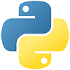

# Aaron Bassett

👋 Hi there! I'm a Principal Software Engineer with over two decades of experience in the tech world. For the last ten years, I've focused on developer relations, where I've thrived in crafting compelling product use cases and educational content that resonate with diverse audiences. My passion for sharing knowledge has led me to become a regular keynote speaker, an educator, a workshop presenter, and a mentor who enjoys guiding the next generation of developers.

## Where to find me

- :bird: https://twitter.com/aaronbassett
- :octocat: https://github.com/aaronbassett
- :briefcase: https://www.linkedin.com/in/aaronbassett/
- :mega: https://noti.st/aaronbassett
- :sparkles: https://www.polywork.com/aaron
- :earth_americas: Miami, FL, USA

---

### [Polkadot Blockchain Academy](https://polkadot.network/development/blockchain-academy/)

I am a [PBA alumni](https://kodadot.xyz/ahk/gallery/u-20-1) and was one of the Smart Contract instructors ([:octopus: ink!](https://use.ink)) for [cohort 3 at UC Berkeley](https://www.youtube.com/watch?v=VTENSTYZmyo).
 

---

### [Django Software Foundation](https://www.djangoproject.com/foundation/)

I've contributed to Django, spoke at several different DjangoCons, and served on the board of the DSF for a number of years, including a stint as vice-president.

---

### [Python Software Foundation](https://www.python.org/psf-landing/)

I've spoken frequently at a range of Python conferences and have been a contributing member of the PSF since ~2017.
